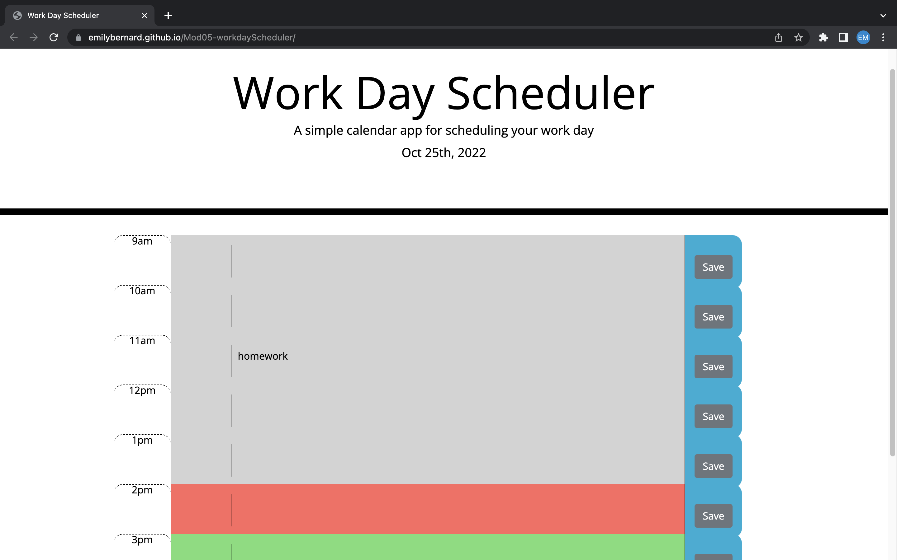

# Mod05-workdayScheduler
Daily workflow calendar for a user to organize daily workflow

# Work Day Scheduler Starter Code
HTML file set-up with links and basic framework of webpage.
CSS file set-up with basic styling.

# Project Status
Submitted for evaluation.

# Project Deployed
https://emilybernard.github.io/Mod05-workdayScheduler/

# Screenshot of webpage

# Installation
Used original HTML and style.css files from assignment.
Used the labels in CSS file to create time-block coding in HTML.
Used HTML coding to create columns within each time row.

# Usage
Users can enter hourly activities and save.
Users can visually see which time rows have already passed, are happening now, or are in the future through color-coding.

# Original Assignment Criteria
<ul>
<li>GIVEN I am using a daily planner to create a schedule
<li>WHEN I open the planner
<li>THEN the current day is displayed at the top of the calendar
<li>WHEN I scroll down
<li>THEN I am presented with time blocks for standard business hours
<li>WHEN I view the time blocks for that day
<li>THEN each time block is color-coded to indicate whether it is in the past, present, or future
<li>WHEN I click into a time block
<li>THEN I can enter an event
<li>WHEN I click the save button for that time block
<li>THEN the text for that event is saved in local storage
<li>WHEN I refresh the page
<li>THEN the saved events persist
</ul>

# Roadmap
This is a basic daily work-hour schedule.  This could be developed to include more features, like autofill, alerts for upcoming events, etc.

# Authors and acknowledgement
Referenced week 5 activities: 02, 25
Referenced work by Emily Wertz (ewirtz3)

